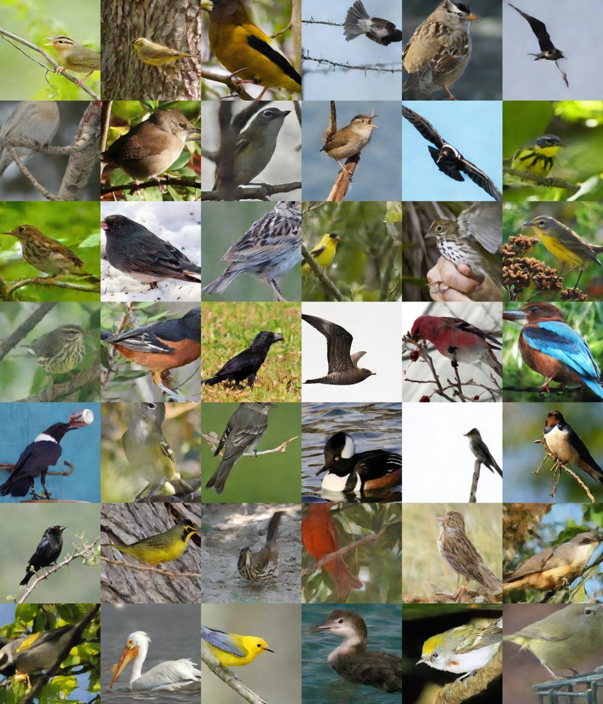

# Rectified flow on Diffusion Transformer backbone 

**Images generated by our model**



## Description

**DiT S/2** model trained on 256x256 resolution with 400k steps on NABirds dataset. 

## Training
- 400k steps
- 256 batch size
- Random crop + 256x256 resize
- AdamW optimizer
- 1e-4 learning rate
- CFG with 0.15 conditioning drop probability

## Inference

Using our inference script, you can generate images with the following command:

```bash
python generate.py --labels 1 2 3 --guidance_scale 1.5 --num_denoising_steps 100
```

## Weights

We do not share weights here. You need to ask for them.